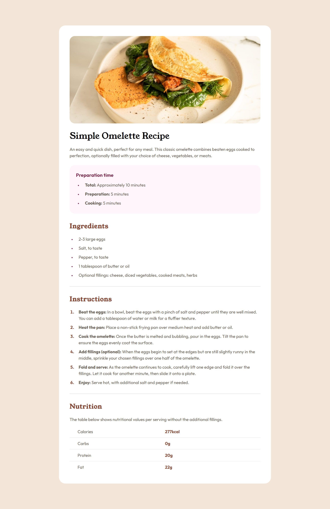

# Frontend Mentor - Recipe page solution

This is a solution to the [Recipe page challenge on Frontend Mentor](https://www.frontendmentor.io/challenges/recipe-page-KiTsR8QQKm). Frontend Mentor challenges help you improve your coding skills by building realistic projects. 

## Table of contents

- [Overview](#overview)
  - [The challenge](#the-challenge)
  - [Screenshot](#screenshot)
  - [Links](#links)
- [My process](#my-process)
  - [Built with](#built-with)
  - [What I learned](#what-i-learned)
  - [Continued development](#continued-development)
  - [Useful resources](#useful-resources)
- [Author](#author)

## Overview

### Screenshot

### Links

- Solution URL: [Solution](https://github.com/antoniomontoia/recipe-page-main)
- Live Site URL: [Live Site](https://antoniomontoia.github.io/recipe-page-main/)

## My process

### Built with

- Semantic HTML5 markup
- CSS custom properties
- Flexbox
- Mobile-first workflow

### What I learned

Semantic HTML: I learned the importance of using semantic HTML elements to enhance the accessibility and readability of my code. By utilizing elements like article, and section, I was able to create a more meaningful and accessible structure for my web pages.

Working with Lists: I deepened my understanding of how to effectively use lists in HTML. I explored both ordered and unordered lists to present information in a clear and concise way.

Utilizing the table Element: I gained hands-on experience with the table element, which can be quite tricky if you are new to it. 

Introduction to Media Queries: I was introduced to working with media queries, which allowed me to create responsive designs that adapt to different screen sizes.

### Continued development

As I move forward, I am eager to deepen my understanding of responsive design and how to ensure that every element on a web page adapts to different screen sizes.

Exploring rem Units: I would like to experiment with rem units for sizing elements, as they provide a more scalable approach compared to pixels.

Advanced Media Queries: I aim to further explore media queries to refine my responsive design skills. I want to learn how to apply different styles not only based on screen width but also on other factors such as orientation and resolution.

### Useful resources

- [Semantic HTML Guide](https://www.semrush.com/blog/semantic-html5-guide) - This helped me with structuring the HTML code. It was quite intuitive and visual.
- [Marker Pseudo-element](https://developer.mozilla.org/en-US/docs/Web/CSS/::marker) - This helped understanding how to style bullet points.

## Author

- Frontend Mentor - [@antoniomontoia](https://www.frontendmentor.io/profile/antoniomontoia)
- Dribbble - [@franissimo](https://www.twitter.com/franissimo)
